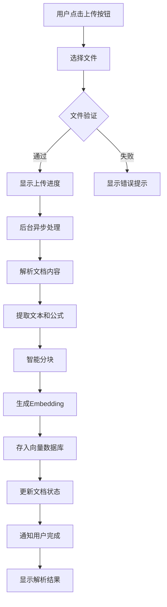
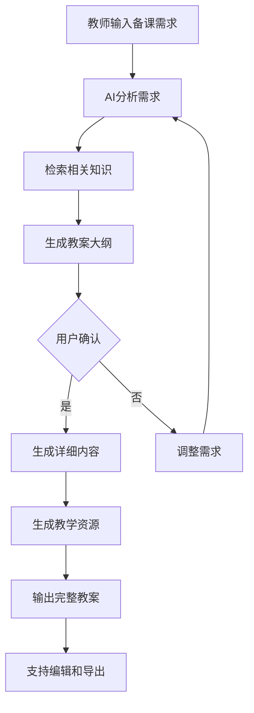
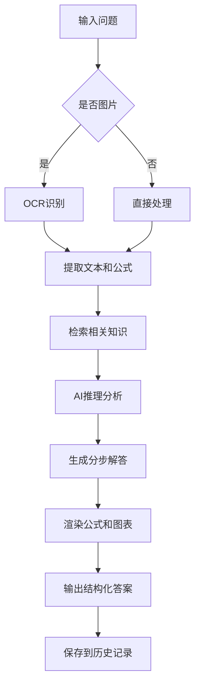
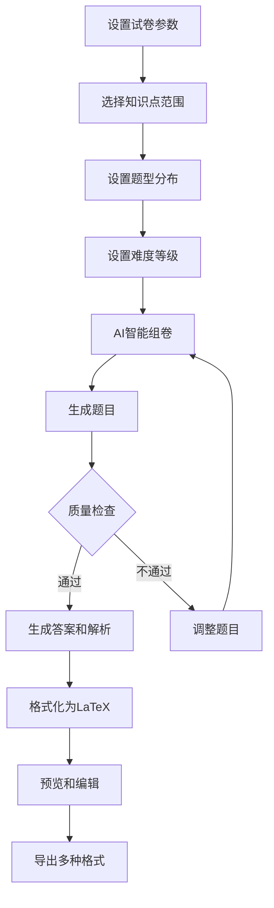

# AI物理教学助手 - 原型设计文档

## 1. 整体布局

```
┌─────────────────────────────────────────────────────────────────────────────┐
│  🔷 PhysicsAI                              👤 教师姓名    ⚙️ 设置    🚪退出     │
├────────────┬────────────────────────────────────────────────────────────────┤
│            │                                                                │
│  📁 知识库  │                    主内容区域                                  │
│  ─────────  │  ┌──────────────────────────────────────────────────────────┐  │
│  📚 我的文档 │  │                                                          │  │
│  📤 上传    │  │                    [欢迎/当前功能]                         │  │
│            │  │                                                          │  │
│  🤖 AI助手  │  └──────────────────────────────────────────────────────────┘  │
│  ─────────  │                                                                │
│  ✏️ 备课助手 │                                                                │
│  ❓ 答疑助手 │                                                                │
│  📄 出卷助手 │                                                                │
│            │                                                                │
│  📊 历史记录 │                                                                │
│  ─────────  │                                                                │
│  📝 备课记录 │                                                                │
│  💬 答疑记录 │                                                                │
│  📋 试卷库  │                                                                │
│            │                                                                │
└────────────┴────────────────────────────────────────────────────────────────┘
```

---

## 2. 🚂功能详细原型

### 2.1 首页/仪表盘页面
```
┌─────────────────────────────────────────────────────────────────────────────┐
│                              🔷 PhysicsAI                                   │
├─────────────────────────────────────────────────────────────────────────────┤
│                                                                             │
│  👋 欢迎回来，今天想做什么？                                                  │
│                                                                             │
│  ┌─────────────┐  ┌─────────────┐  ┌─────────────┐  ┌─────────────┐       │
│  │   📚        │  │   ✏️        │  │   ❓        │  │   📄        │       │
│  │  浏览知识库  │  │  开始备课   │  │  智能答疑   │  │  生成试卷   │       │
│  │             │  │             │  │             │  │             │       │
│  │ [最近文件5] │  │ [模板3]     │  │ [待解答10]  │  │ [草稿2]     │       │
│  └─────────────┘  └─────────────┘  └─────────────┘  └─────────────┘       │
│                                                                             │
│  📈 最近活动                                                                │
│  ┌─────────────────────────────────────────────────────────────────────┐   │
│  │ 今天  10:23  备课《牛顿第二定律》      ✏️                            │   │
│  │ 今天  09:15  答疑 - 斜面运动问题       ❓                            │   │
│  │ 昨天  16:40  生成月考试卷             📄                            │   │
│  └─────────────────────────────────────────────────────────────────────┘   │
│                                                                             │
│  💡 快捷入口                                                                │
│  [上传新教材] [搜索知识点] [快速提问] [最近文档]                              │
│                                                                             │
└─────────────────────────────────────────────────────────────────────────────┘
```

### 2.2 📂知识库管理页面
```
┌─────────────────────────────────────────────────────────────────────────────┐
│  知识库                            [+ 上传文件]  [新建文件夹]  [批量操作]      │
├─────────────────────────────────────────────────────────────────────────────┤
│                                                                             │
│  📁 全部文件 (128)     📁 教材 (12)    📁 课件 (45)    📁 题库 (71)          │
│                                                                             │
│  ┌─────────────────────────────────────────────────────────────────────┐   │
│  │ ☐  │ 名称                    │ 类型   │ 知识点标签      │ 状态   │ 操作  │   │
│  ├─────┼─────────────────────────┼────────┼─────────────────┼────────┼───────┤   │
│  │ ☐   │ 📄 人教版必修一.pdf     │ PDF    │ 力学,运动学     │ ✅ 已解析│ ⋮    │   │
│  │ ☐   │ 📊 力学综合复习.pptx    │ PPT    │ 力学            │ ⏳ 处理中│ ⋮    │   │
│  │ ☐   │ 📄 2024高考真题.pdf     │ PDF    │ 真题,电磁学     │ ✅ 已解析│ ⋮    │   │
│  │ ☐   │ 🖼️ 实验截图.png         │ 图片   │ 光学,实验       │ ✅ 已解析│ ⋮    │   │
│  │ ☐   │ 📊 单元测试卷.docx      │ Word   │ 题库            │ ❌ 失败 │ ⋮    │   │
│  └─────────────────────────────────────────────────────────────────────┘   │
│                                                                             │
│  点击文件查看详情/预览：                                                      │
│  ┌─────────────────────────────────┐  ┌─────────────────────────────────┐   │
│  │  📄 人教版必修一.pdf              │  │  🏷️ 提取的知识点                  │   │
│  │                                 │  │                                 │   │
│  │  [PDF预览区域]                   │  │  • 运动的描述                    │   │
│  │                                 │  │  • 匀变速直线运动                 │   │
│  │                                 │  │  • 相互作用——力                  │   │
│  │                                 │  │  • 牛顿运动定律                  │   │
│  │                                 │  │                                 │   │
│  │  [← → 翻页] [🔍 放大] [📋 OCR]  │  │  [编辑标签] [添加到备课]          │   │
│  └─────────────────────────────────┘  └─────────────────────────────────┘   │
│                                                                             │
└─────────────────────────────────────────────────────────────────────────────┘
```

### 2.3 ✏️备课助手页面
```
┌─────────────────────────────────────────────────────────────────────────────┐
│  AI备课助手                              [清空对话]  [导出教案]              │
├─────────────────────────────────────────────────────────────────────────────┤
│                                                                             │
│  🤖 AI: 你好！我可以帮你准备物理课。请告诉我：                               │
│       • 今天要讲的章节/知识点                                               │
│       • 班级情况（基础/提高班）                                              │
│       • 需要的辅助材料（例题、实验、视频）                                    │
│                                                                             │
│  ┌─────────────────────────────────────────────────────────────────────┐   │
│  👤 你: 准备牛顿第二定律的教案，高二重点班，需要实验演示和典型例题           │   │
│  └─────────────────────────────────────────────────────────────────────┘   │
│                                                                             │
│  🤖 AI: 好的！我来帮你准备《牛顿第二定律》的教案。                           │
│       正在检索相关教材和资料...                                               │
│                                                                             │
│       ┌───────────────────────────────────────────────────────────────┐    │
│       │ 📋 教案大纲                                                   │    │
│       │                                                               │    │
│       │ 一、教学目标                                                  │    │
│       │    • 理解牛顿第二定律的物理意义                               │    │
│       │    • 掌握 $F=ma$ 的应用（矢量性、瞬时性）                     │    │
│       │                                                               │    │
│       │ 二、教学重难点                                                │    │
│       │    • 重点：定律的理解和应用                                   │    │
│       │    • 难点：力和加速度的瞬时对应关系                           │    │
│       │                                                               │    │
│       │ 三、教学流程（45分钟）                                          │    │
│       │    • 导入（5分钟）：生活实例引入                              │    │
│       │    • 新课（25分钟）：定律讲解+实验演示                        │    │
│       │    • 练习（10分钟）：典型例题分析                             │    │
│       │    • 小结（5分钟）：知识梳理+作业布置                         │    │
│       │                                                               │    │
│       │ 四、教学资源                                                  │    │
│       │    • 实验视频：斜面小车实验（链接）                           │    │
│       │    • 典型例题：3道（附详解）                                  │    │
│       │    • 拓展阅读：牛顿第二定律的现代理解                         │    │
│       │                                                               │    │
│       │ 五、示意图代码                                                │    │
│       │ ```python                                                     │    │
│       │ # 牛顿第二定律示意图                                          │    │
│       │ import matplotlib.pyplot as plt                               │    │
│       │ import numpy as np                                            │    │
│       │ # ... 完整代码                                                │    │
│       │ ```                                                           │    │
│       └───────────────────────────────────────────────────────────────┘    │
│                                                                             │
│  [编辑教案] [导出Word] [分享给同事] [添加到我的教案库]                        │
│                                                                             │
└─────────────────────────────────────────────────────────────────────────────┘
```

### 2.4 ❓AI答疑助手页面
```
┌─────────────────────────────────────────────────────────────────────────────┐
│  AI答疑助手                              [新会话]  [历史记录]  [设置]        │
├─────────────────────────────────────────────────────────────────────────────┤
│                                                                             │
│  ┌─────────────────────────────────────────────────────────────────────┐   │
│  │  📁 当前会话：力学问题答疑                                             │   │
│  │  ─────────────────────────────────────────────────────────────────── │   │
│  │                                                                      │   │
│  │  👤 学生问题：                                                        │   │
│  │  一个质量为2kg的物体在水平面上受到10N的水平拉力，摩擦系数为0.2，求      │   │
│  │  物体的加速度。（g=10m/s²）                                           │   │
│  │                                                                      │   │
│  │  🤖 AI解答：                                                          │   │
│  │  **步骤1：分析受力**                                                  │   │
│  │  物体受到四个力：                                                     │   │
│  │  • 重力：$G = mg = 2 \\times 10 = 20\\,N$（向下）                    │   │
│  │  • 支持力：$N = G = 20\\,N$（向上）                                  │   │
│  │  • 拉力：$F = 10\\,N$（水平向右）                                    │   │
│  │  • 摩擦力：$f = \\mu N = 0.2 \\times 20 = 4\\,N$（水平向左）         │   │
│  │                                                                      │   │
│  │  **步骤2：计算合力**                                                  │   │
│  │  水平方向合力：$F_{合} = F - f = 10 - 4 = 6\\,N$                     │   │
│  │                                                                      │   │
│  │  **步骤3：应用牛顿第二定律**                                          │   │
│  │  $a = \\frac{F_{合}}{m} = \\frac{6}{2} = 3\\,m/s^2$                 │   │
│  │                                                                      │   │
│  │  **答案**：物体的加速度为 $3\\,m/s^2$，方向水平向右。                 │   │
│  │                                                                      │   │
│  │  📊 可视化建议：                                                      │   │
│  │  [生成受力分析图]                                                     │   │
│  │                                                                      │   │
│  │  🔗 相关知识点：                                                      │   │
│  │  • 牛顿第二定律                                                       │   │
│  │  • 摩擦力计算                                                         │   │
│  │  • 受力分析                                                           │   │
│  │                                                                      │   │
│  └─────────────────────────────────────────────────────────────────────┘   │
│                                                                             │
│  ┌─────────────────────────────────────────────────────────────────────┐   │
│  │  💬 输入新问题                                                        │   │
│  │  [📝 文字输入] 或 [🖼️ 上传题目图片]                                    │   │
│  │                                                                      │   │
│  │  [发送] [清空] [语音输入]                                             │   │
│  └─────────────────────────────────────────────────────────────────────┘   │
│                                                                             │
└─────────────────────────────────────────────────────────────────────────────┘
```

### 2.5 📄AI出卷助手页面
```
┌─────────────────────────────────────────────────────────────────────────────┐
│  AI出卷助手                              [试卷库]  [模板]  [批量生成]       │
├─────────────────────────────────────────────────────────────────────────────┤
│                                                                             │
│  🎯 试卷生成向导                                                           │
│  ┌─────────────────────────────────────────────────────────────────────┐   │
│  │  步骤1：选择范围                                                      │   │
│  │  [ ] 全部知识点      [✓] 指定章节      [ ] 自定义筛选                  │   │
│  │                                                                      │   │
│  │  已选：必修一 第3章「牛顿运动定律」                                    │   │
│  │                                                                      │   │
│  │  步骤2：设置参数                                                      │   │
│  │  • 试卷类型：[月考] ▾                                                 │   │
│  │  • 难度等级：[中等] ▾                                                 │   │
│  │  • 考试时间：90分钟                                                   │   │
│  │  • 总分值：100分                                                      │   │
│  │                                                                      │   │
│  │  步骤3：题型分布                                                      │   │
│  │  ┌─────────┬─────────┬─────────┬─────────┬─────────┐                │   │
│  │  │ 选择题  │ 填空题  │ 计算题  │ 实验题  │ 综合题  │                │   │
│  │  ├─────────┼─────────┼─────────┼─────────┼─────────┤                │   │
│  │  │   8题   │   5题   │   3题   │   2题   │   1题   │                │   │
│  │  │  32分   │  20分   │  30分   │  12分   │  6分    │                │   │
│  │  └─────────┴─────────┴─────────┴─────────┴─────────┘                │   │
│  │                                                                      │   │
│  │  步骤4：高级选项                                                      │   │
│  │  [✓] 包含答案和解析      [✓] 生成变式题                               │   │
│  │  [ ] 避重复题          [✓] LaTeX格式导出                             │   │
│  │                                                                      │   │
│  │  [← 上一步] [生成试卷 →]                                              │   │
│  └─────────────────────────────────────────────────────────────────────┘   │
│                                                                             │
│  📋 预览区域                                                              │
│  ┌─────────────────────────────────────────────────────────────────────┐   │
│  │  高二物理月考试卷（牛顿运动定律专题）                                  │   │
│  │  考试时间：90分钟      满分：100分                                     │   │
│  │                                                                      │   │
│  │  一、选择题（共8小题，每小题4分，共32分）                              │   │
│  │  1. 关于牛顿第二定律，下列说法正确的是（）                             │   │
│  │     A. 物体的加速度与合外力成正比                                     │   │
│  │     B. 物体的加速度与质量成反比                                       │   │
│  │     C. 加速度的方向与合外力的方向相同                                 │   │
│  │     D. 以上说法都正确                                                 │   │
│  │                                                                      │   │
│  │  2. 质量为2kg的物体，在水平面上受到6N的水平拉力作用，产生2m/s²的加    │   │
│  │     速度，则物体受到的摩擦力大小为（）                                 │   │
│  │     A. 2N          B. 4N          C. 6N          D. 10N             │   │
│  │                                                                      │   │
│  │  [查看全部题目] [编辑题目] [重新生成]                                  │   │
│  └─────────────────────────────────────────────────────────────────────┘   │
│                                                                             │
│  [导出LaTeX] [导出Word] [导出PDF] [保存到试卷库]                           │
│                                                                             │
└─────────────────────────────────────────────────────────────────────────────┘
```

### 2.6 📊历史记录页面
```
┌─────────────────────────────────────────────────────────────────────────────┐
│  历史记录                              [全部] [备课] [答疑] [试卷] [搜索]   │
├─────────────────────────────────────────────────────────────────────────────┤
│                                                                             │
│  📅 时间筛选：[今天] ▾ [本周] [本月] [自定义]                              │
│                                                                             │
│  ┌─────────────────────────────────────────────────────────────────────┐   │
│  │  🕒 今天                                                             │   │
│  │  ┌─────────────────────────────────────────────────────────────┐   │   │
│  │  │ 10:23  ✏️ 备课《牛顿第二定律》                                │   │   │
│  │  │       状态：已完成 | 用时：45秒 | 页数：3                    │   │   │
│  │  │       [查看] [复用] [删除]                                   │   │   │
│  │  └─────────────────────────────────────────────────────────────┘   │   │
│  │                                                                      │   │
│  │  ┌─────────────────────────────────────────────────────────────┐   │   │
│  │  │ 09:15  ❓ 答疑 - 斜面运动问题                                 │   │   │
│  │  │       问题：一个滑块从斜面滑下...                             │   │   │
│  │  │       回答：分5步解析，包含3个公式                           │   │   │
│  │  │       [查看对话] [类似问题] [导出]                           │   │   │
│  │  └─────────────────────────────────────────────────────────────┘   │   │
│  │                                                                      │   │
│  │  🕒 昨天                                                             │   │
│  │  ┌─────────────────────────────────────────────────────────────┐   │   │
│  │  │ 16:40  📄 生成月考试卷                                      │   │   │
│  │  │       范围：必修一第1-3章 | 难度：中等 | 题量：19           │   │   │
│  │  │       [预览试卷] [下载LaTeX] [编辑]                         │   │   │
│  │  └─────────────────────────────────────────────────────────────┘   │   │
│  │                                                                      │   │
│  │  ┌─────────────────────────────────────────────────────────────┐   │   │
│  │  │ 14:30  📁 上传文档《光学实验手册》                           │   │   │
│  │  │       文件：optical_experiment.pdf (8.2MB)                  │   │   │
│  │  │       状态：已解析 | 提取知识点：12个                       │   │   │
│  │  │       [查看文档] [知识点图谱] [分享]                        │   │   │
│  │  └─────────────────────────────────────────────────────────────┘   │   │
│  └─────────────────────────────────────────────────────────────────────┘   │
│                                                                             │
│  📈 数据统计                                                              │
│  ┌─────────┬─────────┬─────────┬─────────┬─────────┐                     │
│  │   项目   │  本周   │  本月   │  总计   │  趋势   │                     │
│  ├─────────┼─────────┼─────────┼─────────┼─────────┤                     │
│  │  备课数  │   5     │   18    │   87    │   ↗️    │                     │
│  │  答疑数  │   23    │   92    │   415   │   ↗️    │                     │
│  │  试卷数  │   2     │   7     │   34    │   →     │                     │
│  │  文档数  │   3     │   12    │   56    │   ↗️    │                     │
│  └─────────┴─────────┴─────────┴─────────┴─────────┘                     │
│                                                                             │
└─────────────────────────────────────────────────────────────────────────────┘
```

---

## 3. 交互流程设计

### 3.1 文档上传流程


### 3.2 AI备课流程


### 3.3 AI答疑流程


### 3.4 AI出卷流程


---

## 4. 响应式设计

### 4.1 桌面端（≥1024px）
- 侧边栏固定宽度：240px
- 主内容区域自适应
- 多列布局支持

### 4.2 平板端（768px-1023px）
- 侧边栏可折叠
- 简化复杂布局
- 增大点击区域

### 4.3 移动端（<768px）
- 单列布局
- 汉堡菜单导航
- 简化表单输入
- 触摸友好设计

### 4.4 关键断点
```css
/* 移动端优先 */
.container {
  padding: 16px;
}

/* 平板端 */
@media (min-width: 768px) {
  .container {
    padding: 24px;
    display: grid;
    grid-template-columns: 240px 1fr;
  }
}

/* 桌面端 */
@media (min-width: 1024px) {
  .container {
    padding: 32px;
    grid-template-columns: 240px 1fr 300px;
  }
}
```

---

## 5. 可访问性设计

### 5.1 键盘导航
- Tab键顺序合理
- 焦点状态明显
- 快捷键支持（Ctrl+S保存等）

### 5.2 屏幕阅读器
- 语义化HTML标签
- ARIA属性完善
- 替代文本描述

### 5.3 颜色对比度
- 文本与背景对比度 ≥ 4.5:1
- 非文本元素对比度 ≥ 3:1
- 提供高对比度模式

### 5.4 字体和间距
- 字体大小可调整（最小16px）
- 行高 ≥ 1.5倍字体大小
- 段落间距 ≥ 2倍行高

---

## 6. 性能优化

### 6.1 加载优化
- 图片懒加载
- 代码分割（按路由）
- 预加载关键资源
- 服务端渲染（SSR）可选

### 6.2 缓存策略
- API响应缓存
- 本地存储缓存
- CDN静态资源
- 浏览器缓存头

### 6.3 网络优化
- HTTP/2 或 HTTP/3
- 资源压缩（Gzip/Brotli）
- 图片优化（WebP格式）
- 减少HTTP请求

### 6.4 渲染性能
- 虚拟滚动长列表
- 防抖和节流
- Web Workers 处理计算
- 避免强制同步布局

---

## 7. 错误状态设计

### 7.1 空状态
```
┌─────────────────────────────────────────────────────────────────────────────┐
│  知识库                                                                     │
├─────────────────────────────────────────────────────────────────────────────┤
│                                                                             │
│  🎯 这里还没有文档                                                          │
│                                                                             │
│  📚 开始建立你的物理教学知识库：                                            │
│                                                                             │
│  ┌─────────────┐  ┌─────────────┐  ┌─────────────┐                        │
│  │  上传教材   │  │  导入题库   │  │  快速示例   │                        │
│  │             │  │             │  │             │                        │
│  │ 支持PDF/Word│  │ Excel/CSV  │  │ 系统示例库  │                        │
│  │   /PPT/图片 │  │             │  │             │                        │
│  └─────────────┘  └─────────────┘  └─────────────┘                        │
│                                                                             │
│  💡 提示：上传教材后，AI会自动解析并建立知识图谱。                          │
│                                                                             │
└─────────────────────────────────────────────────────────────────────────────┘
```

### 7.2 加载状态
```
┌─────────────────────────────────────────────────────────────────────────────┐
│  AI备课助手                                                                 │
├─────────────────────────────────────────────────────────────────────────────┤
│                                                                             │
│  ⏳ AI正在为你备课...                                                        │
│                                                                             │
│  ┌─────────────────────────────────────────────────────────────────────┐   │
│  │  🔍 检索教学资料...                                                    │   │
│  │  ████████████████████████████████████ 65%                            │   │
│  │                                                                      │   │
│  │  📋 已找到：                                                          │   │
│  │  • 相关教材章节：3个                                                  │   │
│  │  • 典型例题：12道                                                     │   │
│  │  • 实验视频：2个                                                      │   │
│  │                                                                      │   │
│  │  🤔 正在生成教案结构...                                                │   │
│  │                                                                      │   │
│  │  预计剩余时间：15秒                                                   │   │
│  └─────────────────────────────────────────────────────────────────────┘   │
│                                                                             │
│  [取消] [后台运行]                                                          │
│                                                                             │
└─────────────────────────────────────────────────────────────────────────────┘
```

### 7.3 错误状态
```
┌─────────────────────────────────────────────────────────────────────────────┐
│  AI答疑助手                                                                 │
├─────────────────────────────────────────────────────────────────────────────┤
│                                                                             │
│  ❌ 抱歉，AI暂时无法回答这个问题                                            │
│                                                                             │
│  ┌─────────────────────────────────────────────────────────────────────┐   │
│  │  可能的原因：                                                          │   │
│  │  • 问题涉及的知识点不在当前知识库中                                    │   │
│  │  • 网络连接不稳定                                                      │   │
│  │  • AI服务暂时不可用                                                   │   │
│  │                                                                      │   │
│  │  建议操作：                                                            │   │
│  │  [重试] [简化问题] [上传相关教材] [联系技术支持]                       │   │
│  │                                                                      │   │
│  │  错误代码：AI_QA_003                                                  │   │
│  │  时间：2026-03-04 15:30:08                                            │   │
│  └─────────────────────────────────────────────────────────────────────┘   │
│                                                                             │
│  📞 需要帮助？联系 support@physicsai.com                                  │
│                                                                             │
└─────────────────────────────────────────────────────────────────────────────┘
```

### 7.4 成功状态
```
┌─────────────────────────────────────────────────────────────────────────────┐
│  文档上传                                                                   │
├─────────────────────────────────────────────────────────────────────────────┤
│                                                                             │
│  ✅ 文档上传并解析成功！                                                    │
│                                                                             │
│  ┌─────────────────────────────────────────────────────────────────────┐   │
│  │  📄 人教版必修一.pdf                                                   │   │
│  │                                                                      │   │
│  │  📊 解析结果：                                                          │   │
│  │  • 总页数：156页                                                       │   │
│  │  • 提取文本：42,358字                                                  │   │
│  │  • 识别公式：287个                                                     │   │
│  │  • 提取图片：45张                                                      │   │
│  │  • 识别表格：12个                                                      │   │
│  │                                                                      │   │
│  │  🏷️ 自动标注知识点：                                                    │   │
│  │  • 运动的描述                                                          │   │
│  │  • 匀变速直线运动                                                      │   │
│  │  • 相互作用——力                                                        │   │
│  │  • 牛顿运动定律                                                        │   │
│  │                                                                      │   │
│  │  [查看详情] [编辑标签] [开始备课] [分享]                               │   │
│  └─────────────────────────────────────────────────────────────────────┘   │
│                                                                             │
│  🎉 文档已加入知识库，AI可以基于此内容为你服务了！                          │
│                                                                             │
└─────────────────────────────────────────────────────────────────────────────┘
```

---

## 8. 用户引导和帮助

### 8.1 首次使用引导
```
┌─────────────────────────────────────────────────────────────────────────────┐
│  👋 欢迎使用 PhysicsAI！                                                   │
├─────────────────────────────────────────────────────────────────────────────┤
│                                                                             │
│  让我带你快速了解如何使用：                                                │
│                                                                             │
│  ┌─────────┬─────────┬─────────┬─────────┬─────────┐                     │
│  │  步骤1  │  步骤2  │  步骤3  │  步骤4  │  步骤5  │                     │
│  ├─────────┼─────────┼─────────┼─────────┼─────────┤                     │
│  │ 上传教材│ 建立知识│ 开始备课│ AI答疑  │ 生成试卷│                     │
│  │         │ 库      │         │         │         │                     │
│  └─────────┴─────────┴─────────┴─────────┴─────────┘                     │
│                                                                             │
│  🎯 当前：步骤1 - 上传教材                                                  │
│                                                                             │
│  📚 上传你的第一份教材：                                                    │
│  [选择文件] 或 [拖拽到这里]                                                 │
│                                                                             │
│  支持格式：PDF、Word、PPT、图片                                             │
│  建议：从《人教版高中物理必修一》开始                                       │
│                                                                             │
│  [跳过引导] [下一步]                                                       │
│                                                                             │
└─────────────────────────────────────────────────────────────────────────────┘
```

### 8.2 功能提示
```
┌─────────────────────────────────────────────────────────────────────────────┐
│  💡 小贴士                                                                  │
├─────────────────────────────────────────────────────────────────────────────┤
│                                                                             │
│  你知道吗？                                                                │
│                                                                             │
│  • 在答疑时上传题目图片，AI会自动识别文字和公式                            │
│  • 备课助手支持语音输入，说出的需求会自动转为文字                          │
│  • 生成的试卷可以一键导出为LaTeX，方便排版印刷                            │
│  • 知识库中的文档可以分享给同事，共同建设教学资源库                        │
│                                                                             │
│  [不再显示] [查看更多技巧]                                                 │
│                                                                             │
└─────────────────────────────────────────────────────────────────────────────┘
```

### 8.3 快捷键参考
```
┌─────────────────────────────────────────────────────────────────────────────┐
│  ⌨️ 快捷键参考                                                              │
├─────────────────────────────────────────────────────────────────────────────┤
│                                                                             │
│  全局快捷键：                                                              │
│  • Ctrl/Cmd + N：新建备课                                                   │
│  • Ctrl/Cmd + K：快速搜索                                                   │
│  • Ctrl/Cmd + S：保存当前内容                                               │
│  • Ctrl/Cmd + P：打印/导出                                                  │
│  • Ctrl/Cmd + ?：显示帮助                                                   │
│                                                                             │
│  编辑器快捷键：                                                            │
│  • Ctrl/Cmd + B：加粗                                                      │
│  • Ctrl/Cmd + I：斜体                                                      │
│  • $$：插入LaTeX公式                                                       │
│  • Ctrl/Cmd + Enter：发送消息                                              │
│                                                                             │
│  [关闭] [自定义快捷键]                                                     │
│                                                                             │
└─────────────────────────────────────────────────────────────────────────────┘
```

---

## 9. 设计系统规范

### 9.1 颜色系统
```css
/* 主色调 */
--primary-color: #1890ff;      /* 蓝色 - 主要操作 */
--success-color: #52c41a;      /* 绿色 - 成功状态 */
--warning-color: #faad14;      /* 黄色 - 警告状态 */
--error-color: #ff4d4f;        /* 红色 - 错误状态 */

/* 中性色 */
--text-primary: #262626;       /* 主要文字 */
--text-secondary: #595959;     /* 次要文字 */
--text-disabled: #bfbfbf;      /* 禁用文字 */
--border-color: #d9d9d9;       /* 边框颜色 */
--background-color: #f5f5f5;   /* 背景颜色 */

/* 物理主题色 */
--physics-blue: #2f54eb;       /* 物理蓝 */
--mechanics-orange: #fa8c16;   /* 力学橙 */
--electromagnetism-purple: #722ed1; /* 电磁紫 */
--optics-yellow: #fadb14;      /* 光学黄 */
```

### 9.2 字体系统
```css
/* 字体家族 */
--font-family: -apple-system, BlinkMacSystemFont, 'Segoe UI', Roboto, 
               'Helvetica Neue', Arial, 'Noto Sans', sans-serif;
--font-family-code: 'SFMono-Regular', Consolas, 'Liberation Mono', Menlo, 
                    Courier, monospace;
--font-family-formula: 'Cambria Math', 'Latin Modern Math', STIX, serif;

/* 字体大小 */
--font-size-xs: 12px;    /* 辅助文字 */
--font-size-sm: 14px;    /* 正文（小） */
--font-size-base: 16px;  /* 正文 */
--font-size-lg: 18px;    /* 小标题 */
--font-size-xl: 20px;    /* 标题 */
--font-size-xxl: 24px;   /* 大标题 */
```

### 9.3 间距系统（8px基准）
```css
--space-1: 4px;    /* 微小间距 */
--space-2: 8px;    /* 基础间距 */
--space-3: 12px;   /* 中等间距 */
--space-4: 16px;   /* 常规间距 */
--space-5: 24px;   /* 较大间距 */
--space-6: 32px;   /* 大间距 */
--space-7: 48px;   /* 超大间距 */
```

### 9.4 圆角系统
```css
--border-radius-sm: 2px;   /* 小圆角 */
--border-radius-base: 4px; /* 基础圆角 */
--border-radius-lg: 8px;   /* 大圆角 */
--border-radius-xl: 12px;  /* 超大圆角 */
--border-radius-circle: 50%; /* 圆形 */
```

### 9.5 阴影系统
```css
--shadow-sm: 0 1px 2px rgba(0, 0, 0, 0.05);
--shadow-base: 0 2px 8px rgba(0, 0, 0, 0.1);
--shadow-lg: 0 4px 16px rgba(0, 0, 0, 0.15);
--shadow-xl: 0 8px 32px rgba(0, 0, 0, 0.2);
```

---

## 10. 组件状态规范

### 10.1 按钮状态
```css
/* 默认状态 */
.button {
  background: var(--primary-color);
  color: white;
  border: 1px solid var(--primary-color);
}

/* 悬停状态 */
.button:hover {
  background: #40a9ff;
  border-color: #40a9ff;
}

/* 点击状态 */
.button:active {
  background: #096dd9;
  border-color: #096dd9;
}

/* 禁用状态 */
.button:disabled {
  background: #f5f5f5;
  color: var(--text-disabled);
  border-color: var(--border-color);
  cursor: not-allowed;
}
```

### 10.2 输入框状态
```css
/* 默认状态 */
.input {
  border: 1px solid var(--border-color);
  background: white;
}

/* 聚焦状态 */
.input:focus {
  border-color: var(--primary-color);
  box-shadow: 0 0 0 2px rgba(24, 144, 255, 0.2);
}

/* 错误状态 */
.input.error {
  border-color: var(--error-color);
}

/* 成功状态 */
.input.success {
  border-color: var(--success-color);
}
```

### 10.3 加载状态
```css
/* 旋转动画 */
@keyframes spin {
  from { transform: rotate(0deg); }
  to { transform: rotate(360deg); }
}

.spinner {
  animation: spin 1s linear infinite;
}

/* 骨架屏 */
.skeleton {
  background: linear-gradient(90deg, #f0f0f0 25%, #e0e0e0 50%, #f0f0f0 75%);
  background-size: 200% 100%;
  animation: loading 1.5s infinite;
}

@keyframes loading {
  0% { background-position: 200% 0; }
  100% { background-position: -200% 0; }
}
```

---

**原型设计文档完成** ✅

现在我们已经有了完整的UI界面设计、交互流程、响应式设计、可访问性设计、性能优化方案、错误状态处理、用户引导系统、设计系统规范和组件状态规范。

下一步可以开始**编写代码实现**了！