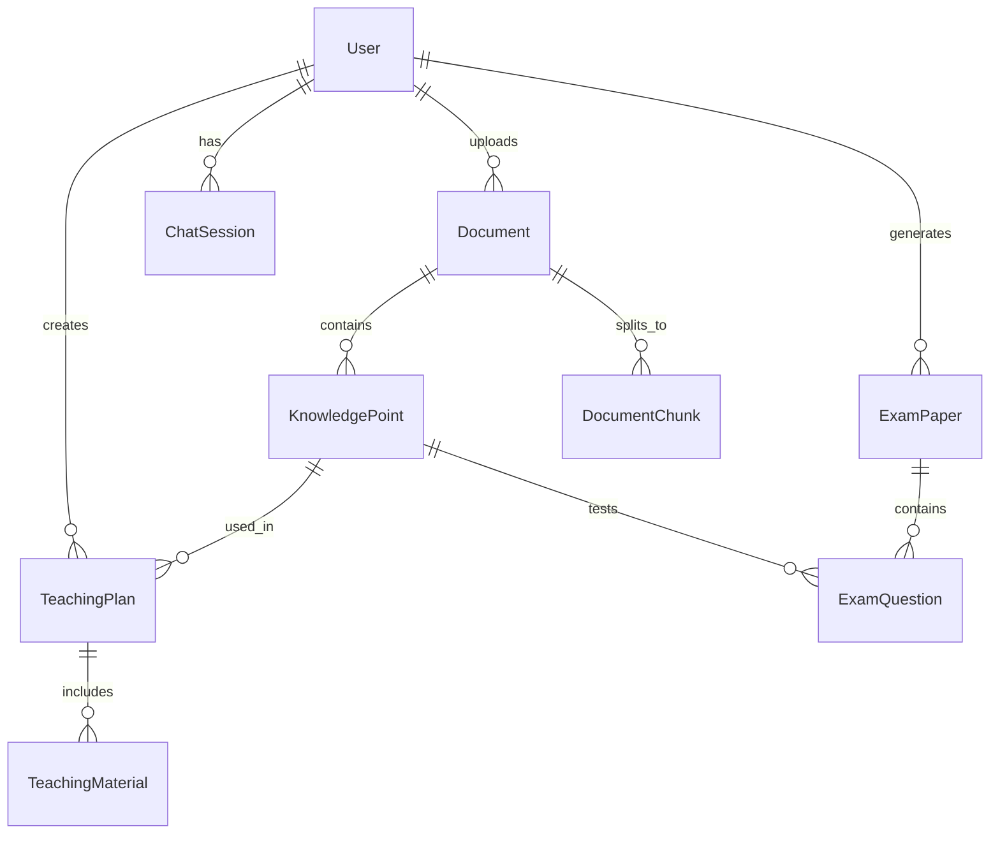

# AI物理教学助手 - 详细设计文档

## 学习目标（Java → 大模型开发转型）

在开始详细设计前，明确本项目将帮助你掌握的核心技能：

### 1. Python工程能力
- FastAPI异步Web框架
- Pydantic数据验证
- 类型注解和静态检查
- 异步任务处理（Celery/Background Tasks）

### 2. LLM应用开发
- 多模型API调用（通义/智谱/DeepSeek）
- Function Calling工具调用
- Prompt Engineering技巧
- 结构化输出控制

### 3. RAG全链路实现
- 文档解析与预处理
- 文本分块策略
- Embedding向量化
- 向量数据库检索
- 上下文压缩与重排序

### 4. AI Agent设计
- ReAct模式实现
- 工具定义与执行
- 记忆管理
- 多步骤推理

---

## 1. 数据库设计

### 1.1 核心实体关系图


### 1.2 数据表设计

#### 用户表 (users)
```sql
CREATE TABLE users (
    id INTEGER PRIMARY KEY AUTOINCREMENT,
    username VARCHAR(50) UNIQUE NOT NULL,
    email VARCHAR(100) UNIQUE,
    role VARCHAR(20) DEFAULT 'teacher',  -- teacher, admin
    created_at TIMESTAMP DEFAULT CURRENT_TIMESTAMP,
    updated_at TIMESTAMP DEFAULT CURRENT_TIMESTAMP
);
```

#### 文档表 (documents)
```sql
CREATE TABLE documents (
    id INTEGER PRIMARY KEY AUTOINCREMENT,
    user_id INTEGER NOT NULL,
    filename VARCHAR(255) NOT NULL,
    filepath VARCHAR(500) NOT NULL,
    file_type VARCHAR(20),  -- pdf, docx, pptx, image
    file_size INTEGER,
    status VARCHAR(20) DEFAULT 'uploaded',  -- uploaded, processing, processed, failed
    metadata JSON,  -- 存储解析后的元数据
    created_at TIMESTAMP DEFAULT CURRENT_TIMESTAMP,
    processed_at TIMESTAMP,
    FOREIGN KEY (user_id) REFERENCES users(id)
);
```

#### 文档分块表 (document_chunks)
```sql
CREATE TABLE document_chunks (
    id INTEGER PRIMARY KEY AUTOINCREMENT,
    document_id INTEGER NOT NULL,
    chunk_index INTEGER NOT NULL,
    content TEXT NOT NULL,
    content_type VARCHAR(20),  -- text, formula, table, image
    page_number INTEGER,
    embedding_vector BLOB,  -- 存储BGE embedding向量
    metadata JSON,  -- 位置信息、上下文等
    created_at TIMESTAMP DEFAULT CURRENT_TIMESTAMP,
    FOREIGN KEY (document_id) REFERENCES documents(id),
    UNIQUE(document_id, chunk_index)
);
```

#### 知识点表 (knowledge_points)
```sql
CREATE TABLE knowledge_points (
    id INTEGER PRIMARY KEY AUTOINCREMENT,
    name VARCHAR(100) NOT NULL,
    description TEXT,
    category VARCHAR(50),  -- 力学, 电磁学, 光学等
    grade_level VARCHAR(20),  -- 高一, 高二, 高三
    difficulty VARCHAR(20),  -- 基础, 中等, 困难
    created_at TIMESTAMP DEFAULT CURRENT_TIMESTAMP
);
```

#### 教案表 (teaching_plans)
```sql
CREATE TABLE teaching_plans (
    id INTEGER PRIMARY KEY AUTOINCREMENT,
    user_id INTEGER NOT NULL,
    title VARCHAR(200) NOT NULL,
    knowledge_point_id INTEGER,
    content JSON NOT NULL,  -- 结构化教案内容
    status VARCHAR(20) DEFAULT 'draft',  -- draft, completed, published
    created_at TIMESTAMP DEFAULT CURRENT_TIMESTAMP,
    updated_at TIMESTAMP DEFAULT CURRENT_TIMESTAMP,
    FOREIGN KEY (user_id) REFERENCES users(id),
    FOREIGN KEY (knowledge_point_id) REFERENCES knowledge_points(id)
);
```

#### 聊天会话表 (chat_sessions)
```sql
CREATE TABLE chat_sessions (
    id INTEGER PRIMARY KEY AUTOINCREMENT,
    user_id INTEGER NOT NULL,
    session_type VARCHAR(20) DEFAULT 'qa',  -- qa, teaching, exam
    title VARCHAR(200),
    context JSON,  -- 会话上下文
    created_at TIMESTAMP DEFAULT CURRENT_TIMESTAMP,
    updated_at TIMESTAMP DEFAULT CURRENT_TIMESTAMP,
    FOREIGN KEY (user_id) REFERENCES users(id)
);
```

#### 聊天消息表 (chat_messages)
```sql
CREATE TABLE chat_messages (
    id INTEGER PRIMARY KEY AUTOINCREMENT,
    session_id INTEGER NOT NULL,
    role VARCHAR(20) NOT NULL,  -- user, assistant, system
    content TEXT NOT NULL,
    metadata JSON,  -- 工具调用、引用文档等
    created_at TIMESTAMP DEFAULT CURRENT_TIMESTAMP,
    FOREIGN KEY (session_id) REFERENCES chat_sessions(id)
);
```

#### 试卷表 (exam_papers)
```sql
CREATE TABLE exam_papers (
    id INTEGER PRIMARY KEY AUTOINCREMENT,
    user_id INTEGER NOT NULL,
    title VARCHAR(200) NOT NULL,
    paper_type VARCHAR(20),  -- quiz, test, exam
    difficulty VARCHAR(20),
    total_score INTEGER,
    time_limit INTEGER,  -- 分钟
    content JSON NOT NULL,  -- 试卷结构
    latex_content TEXT,  -- LaTeX格式
    created_at TIMESTAMP DEFAULT CURRENT_TIMESTAMP,
    FOREIGN KEY (user_id) REFERENCES users(id)
);
```

---

## 2. 后端服务详细设计

### 2.1 项目结构（完整版）
```
backend/
├── app/
│   ├── __init__.py
│   ├── main.py                    # FastAPI应用入口
│   ├── config.py                  # 配置管理（环境变量、模型配置等）
│   ├── dependencies.py            # 依赖注入（数据库、认证等）
│   ├── models/                    # Pydantic数据模型
│   │   ├── __init__.py
│   │   ├── user.py               # 用户相关模型
│   │   ├── document.py           # 文档相关模型
│   │   ├── chat.py               # 聊天相关模型
│   │   ├── teaching.py           # 教案相关模型
│   │   └── exam.py               # 试卷相关模型
│   ├── routers/                   # API路由
│   │   ├── __init__.py
│   │   ├── auth.py               # 认证相关
│   │   ├── documents.py          # 文档管理API
│   │   ├── chat.py               # AI问答API
│   │   ├── teaching.py           # 备课助手API
│   │   ├── exam.py               # 出卷助手API
│   │   └── tools.py              # 工具调用API
│   ├── services/                  # 业务逻辑层
│   │   ├── __init__.py
│   │   ├── database.py           # 数据库连接和操作
│   │   ├── auth_service.py       # 认证服务
│   │   ├── file_service.py       # 文件处理服务
│   │   ├── rag/                  # RAG相关服务
│   │   │   ├── __init__.py
│   │   │   ├── document_loader.py    # 文档加载器
│   │   │   ├── text_splitter.py      # 文本分块
│   │   │   ├── embedding_service.py  # Embedding服务
│   │   │   ├── vector_store.py       # 向量存储
│   │   │   └── retrieval_service.py  # 检索服务
│   │   ├── llm/                  # LLM相关服务
│   │   │   ├── __init__.py
│   │   │   ├── client.py         # LLM客户端（多模型支持）
│   │   │   ├── prompt_templates.py # Prompt模板
│   │   │   └── structured_output.py # 结构化输出
│   │   ├── agent/                # AI Agent服务
│   │   │   ├── __init__.py
│   │   │   ├── teaching_agent.py     # 备课Agent
│   │   │   ├── qa_agent.py           # 答疑Agent
│   │   │   ├── exam_agent.py         # 出卷Agent
│   │   │   └── tools/                # 工具定义
│   │   │       ├── __init__.py
│   │   │       ├── chart_tool.py     # 图表生成工具
│   │   │       ├── latex_tool.py     # LaTeX工具
│   │   │       ├── video_tool.py     # 视频推荐工具
│   │   │       └── calculator_tool.py # 物理计算工具
│   │   └── exam_service.py       # 试卷生成服务
│   ├── utils/                    # 工具函数
│   │   ├── __init__.py
│   │   ├── helpers.py            # 通用帮助函数
│   │   ├── latex_utils.py        # LaTeX相关工具
│   │   └── ocr_utils.py          # OCR工具
│   └── schemas/                  # SQLAlchemy模型（可选）
│       ├── __init__.py
│       └── models.py
├── tests/                        # 测试
│   ├── __init__.py
│   ├── test_api.py
│   ├── test_services.py
│   └── test_rag.py
├── alembic/                      # 数据库迁移
│   ├── versions/
│   └── alembic.ini
├── data/                         # 数据目录
│   ├── uploads/                  # 上传文件
│   └── cache/                    # 缓存
├── requirements.txt              # Python依赖
├── pyproject.toml               # Poetry配置
├── .env.example                 # 环境变量示例
└── README.md                    # 项目说明
```

### 2.2 核心服务实现要点

#### 2.2.1 配置管理 (config.py)
```python
# 学习点：Python配置管理、环境变量、类型安全
from pydantic_settings import BaseSettings
from typing import Optional

class Settings(BaseSettings):
    # 数据库配置
    database_url: str = "sqlite:///./physics_ai.db"
    
    # LLM API配置
    openai_api_key: Optional[str] = None
    openai_base_url: Optional[str] = None
    deepseek_api_key: Optional[str] = None
    zhipu_api_key: Optional[str] = None
    
    # 模型选择
    default_llm_model: str = "deepseek-chat"
    embedding_model: str = "BAAI/bge-large-zh-v1.5"
    
    # 文件存储
    upload_dir: str = "./data/uploads"
    max_upload_size: int = 100 * 1024 * 1024  # 100MB
    
    class Config:
        env_file = ".env"
```

#### 2.2.2 文档加载器 (document_loader.py)
```python
# 学习点：多格式文档处理、异步IO、错误处理
import asyncio
from typing import List, Dict, Any
from abc import ABC, abstractmethod

class DocumentLoader(ABC):
    """文档加载器抽象基类"""
    
    @abstractmethod
    async def load(self, file_path: str) -> List[Dict[str, Any]]:
        """加载文档并返回结构化数据"""
        pass

class PDFLoader(DocumentLoader):
    """PDF文档加载器"""
    
    async def load(self, file_path: str) -> List[Dict[str, Any]]:
        # 使用PyMuPDF异步加载PDF
        import fitz
        
        documents = []
        try:
            doc = fitz.open(file_path)
            for page_num in range(len(doc)):
                page = doc[page_num]
                text = page.get_text()
                
                # 提取图片和公式
                images = self._extract_images(page)
                formulas = self._extract_formulas(page)
                
                documents.append({
                    "page": page_num + 1,
                    "content": text,
                    "images": images,
                    "formulas": formulas,
                    "metadata": {
                        "file_path": file_path,
                        "page_size": page.rect
                    }
                })
            return documents
        except Exception as e:
            raise DocumentLoadError(f"PDF加载失败: {str(e)}")
```

#### 2.2.3 文本分块器 (text_splitter.py)
```python
# 学习点：文本处理、语义分块、中文处理
from typing import List, Dict, Any
from langchain.text_splitter import RecursiveCharacterTextSplitter

class PhysicsTextSplitter:
    """针对物理文档的智能分块器"""
    
    def __init__(self):
        # 中文分块配置
        self.splitter = RecursiveCharacterTextSplitter(
            chunk_size=500,
            chunk_overlap=50,
            separators=[
                "\n\n",  # 段落
                "\n",    # 换行
                "。",    # 句号
                "！",    # 感叹号
                "？",    # 问号
                "；",    # 分号
                "，",    # 逗号
                " ",     # 空格
                ""       # 最后手段
            ],
            length_function=len,
        )
    
    def split_document(self, document: Dict[str, Any]) -> List[Dict[str, Any]]:
        """将文档分块，保留元数据"""
        chunks = []
        text = document["content"]
        
        # 按语义分块
        text_chunks = self.splitter.split_text(text)
        
        for i, chunk_text in enumerate(text_chunks):
            chunk = {
                "chunk_index": i,
                "content": chunk_text,
                "content_type": "text",
                "page_number": document.get("page", 1),
                "metadata": {
                    **document.get("metadata", {}),
                    "chunk_size": len(chunk_text),
                    "has_formula": self._contains_formula(chunk_text),
                    "has_table": self._contains_table(chunk_text)
                }
            }
            chunks.append(chunk)
        
        return chunks
```

#### 2.2.4 Embedding服务 (embedding_service.py)
```python
# 学习点：向量化、模型调用、缓存优化
import numpy as np
from typing import List, Optional
from sentence_transformers import SentenceTransformer
import hashlib
import json

class EmbeddingService:
    """Embedding服务，支持缓存"""
    
    def __init__(self, model_name: str = "BAAI/bge-large-zh-v1.5"):
        # 学习点：模型加载、GPU/CPU适配
        self.model = SentenceTransformer(model_name)
        self.cache = {}  # 简单内存缓存，生产环境用Redis
        
    def get_embedding(self, text: str) -> np.ndarray:
        """获取文本的embedding向量"""
        # 生成缓存键
        cache_key = self._generate_cache_key(text)
        
        # 检查缓存
        if cache_key in self.cache:
            return self.cache[cache_key]
        
        # 计算embedding
        embedding = self.model.encode(text, normalize_embeddings=True)
        
        # 缓存结果
        self.cache[cache_key] = embedding
        
        return embedding
    
    def batch_embed(self, texts: List[str]) -> List[np.ndarray]:
        """批量计算embedding"""
        return [self.get_embedding(text) for text in texts]
    
    def _generate_cache_key(self, text: str) -> str:
        """生成缓存键"""
        return hashlib.md5(text.encode()).hexdigest()
```

#### 2.2.5 LLM客户端 (client.py)
```python
# 学习点：多模型API调用、错误处理、流式响应
from typing import Optional, AsyncGenerator, Dict, Any
import httpx
from openai import AsyncOpenAI

class LLMClient:
    """统一的LLM客户端，支持多个提供商"""
    
    def __init__(self, config: Dict[str, Any]):
        self.config = config
        self.clients = {}
        
        # 初始化各个提供商客户端
        if config.get("openai_api_key"):
            self.clients["openai"] = AsyncOpenAI(
                api_key=config["openai_api_key"],
                base_url=config.get("openai_base_url")
            )
        
        if config.get("deepseek_api_key"):
            self.clients["deepseek"] = AsyncOpenAI(
                api_key=config["deepseek_api_key"],
                base_url="https://api.deepseek.com/v1"
            )
    
    async def chat_completion(
        self,
        messages: List[Dict[str, str]],
        model: str = "deepseek-chat",
        temperature: float = 0.7,
        stream: bool = False
    ) -> AsyncGenerator[str, None]:
        """聊天补全，支持流式响应"""
        
        # 根据模型选择客户端
        if "deepseek" in model:
            client = self.clients["deepseek"]
        elif "gpt" in model:
            client = self.clients["openai"]
        else:
            raise ValueError(f"不支持的模型: {model}")
        
        try:
            response = await client.chat.completions.create(
                model=model,
                messages=messages,
                temperature=temperature,
                stream=stream
            )
            
            if stream:
                async for chunk in response:
                    if chunk.choices[0].delta.content:
                        yield chunk.choices[0].delta.content
            else:
                return response.choices[0].message.content
                
        except Exception as e:
            raise LLMError(f"LLM调用失败: {str(e)}")
    
    async def structured_completion(
        self,
        prompt: str,
        response_schema: Dict[str, Any],
        model: str = "deepseek-chat"
    ) -> Dict[str, Any]:
        """结构化输出，用于教案、试卷等"""
        # 学习点：Function Calling、结构化输出控制
        messages = [
            {"role": "system", "content": "你是一个物理教学专家，请严格按照要求输出结构化数据。"},
            {"role": "user", "content": prompt}
        ]
        
        tools = [{
            "type": "function",
            "function": {
                "name": "format_response",
                "description": "格式化响应数据",
                "parameters": response_schema
            }
        }]
        
        response = await self.clients["deepseek"].chat.completions.create(
            model=model,
            messages=messages,
            tools=tools,
            tool_choice={"type": "function", "function": {"name": "format_response"}}
        )
        
        # 解析工具调用结果
        tool_call = response.choices[0].message.tool_calls[0]
        arguments = json.loads(tool_call.function.arguments)
        
        return arguments
```

### 2.2.6 备课Agent (teaching_agent.py)
```python
# 学习点：AI Agent设计、工具调用、多步骤推理
from typing import Dict, Any, List
from langchain.agents import AgentExecutor, create_react_agent
from langchain.tools import Tool
from langchain.prompts import PromptTemplate

class TeachingAgent:
    """备课AI Agent"""
    
    def __init__(self, llm_client, retrieval_service, tools: List[Tool]):
        self.llm_client = llm_client
        self.retrieval_service = retrieval_service
        self.tools = tools
        
        # ReAct Agent提示词
        self.prompt = PromptTemplate.from_template("""
        你是一个高中物理教学专家，正在帮助教师准备教案。
        
        当前任务：{task}
        班级情况：{class_info}
        特殊要求：{requirements}
        
        请按照以下步骤思考：
        1. 分析教学目标和重难点
        2. 检索相关教学资料
        3. 设计教学流程
        4. 准备教学材料
        
        你可以使用以下工具：
        {tools}
        
        开始思考...
        """)
        
        # 创建Agent
        self.agent = create_react_agent(
            llm=self.llm_client,
            tools=self.tools,
            prompt=self.prompt
        )
        self.agent_executor = AgentExecutor(
            agent=self.agent,
            tools=self.tools,
            verbose=True,
            handle_parsing_errors=True
        )
    
    async def create_teaching_plan(self, task: str, class_info: str, requirements: str = "") -> Dict[str, Any]:
        """创建教案"""
        # 学习点：Agent执行、工具调用链
        result = await self.agent_executor.ainvoke({
            "task": task,
            "class_info": class_info,
            "requirements": requirements,
            "tools": "\n".join([f"- {tool.name}: {tool.description}" for tool in self.tools])
        })
        
        return {
            "teaching_plan": result["output"],
            "steps_taken": result.get("intermediate_steps", []),
            "tools_used": [step[0].tool for step in result.get("intermediate_steps", [])]
        }
```

### 2.2.7 图表生成工具 (chart_tool.py)
```python
# 学习点：工具定义、代码生成、物理可视化
import matplotlib.pyplot as plt
import numpy as np
from typing import Dict, Any
import base64
from io import BytesIO

class ChartTool:
    """物理图表生成工具"""
    
    def __init__(self):
        self.supported_charts = {
            "motion": self._generate_motion_chart,
            "force": self._generate_force_diagram,
            "circuit": self._generate_circuit_diagram,
            "wave": self._generate_wave_chart
        }
    
    async def generate_chart(self, chart_type: str, parameters: Dict[str, Any]) -> Dict[str, Any]:
        """生成物理图表"""
        if chart_type not in self.supported_charts:
            raise ValueError(f"不支持的图表类型: {chart_type}")
        
        # 调用对应的生成函数
        fig = await self.supported_charts[chart_type](parameters)
        
        # 转换为base64
        buffer = BytesIO()
        fig.savefig(buffer, format='png', dpi=150)
        buffer.seek(0)
        img_base64 = base64.b64encode(buffer.getvalue()).decode()
        
        # 生成matplotlib代码
        code = self._generate_matplotlib_code(chart_type, parameters)
        
        return {
            "image_base64": img_base64,
            "matplotlib_code": code,
            "chart_type": chart_type,
            "parameters": parameters
        }
    
    def _generate_motion_chart(self, params: Dict[str, Any]) -> plt.Figure:
        """生成运动学图表"""
        fig, ax = plt.subplots(figsize=(10, 6))
        
        # 示例：匀加速直线运动
        t = np.linspace(0, params.get("time", 10), 100)
        v0 = params.get("initial_velocity", 0)
        a = params.get("acceleration", 2)
        
        s = v0 * t + 0.5 * a * t**2
        v = v0 + a * t
        
        ax.plot(t, s, 'b-', label='位移 (m)')
        ax.plot(t, v, 'r--', label='速度 (m/s)')
        
        ax.set_xlabel('时间 (s)')
        ax.set_ylabel('物理量')
        ax.set_title('匀加速直线运动')
        ax.legend()
        ax.grid(True)
        
        return fig
    
    def _generate_matplotlib_code(self, chart_type: str, params: Dict[str, Any]) -> str:
        """生成可复用的matplotlib代码"""
        code_templates = {
            "motion": '''
import matplotlib.pyplot as plt
import numpy as np

# 参数设置
v0 = {initial_velocity}  # 初速度 (m/s)
a = {acceleration}       # 加速度 (m/s²)
t_max = {time}           # 时间范围 (s)

# 计算
t = np.linspace(0, t_max, 100)
s = v0 * t + 0.5 * a * t**2  # 位移
v = v0 + a * t               # 速度

# 绘图
fig, ax = plt.subplots(figsize=(10, 6))
ax.plot(t, s, 'b-', label='位移 (m)')
ax.plot(t, v, 'r--', label='速度 (m/s)')

ax.set_xlabel('时间 (s)')
ax.set_ylabel('物理量')
ax.set_title('匀加速直线运动')
ax.legend()
ax.grid(True)
plt.tight_layout()
plt.show()
'''
        }
        
        return code_templates.get(chart_type, "# 图表代码生成失败").format(**params)
```

---

## 3. API接口设计

### 3.1 认证相关API

#### POST /api/auth/register - 用户注册
```python
# 学习点：FastAPI路由、请求验证、密码哈希
from fastapi import APIRouter, Depends, HTTPException
from pydantic import BaseModel, EmailStr

router = APIRouter(prefix="/auth", tags=["认证"])

class RegisterRequest(BaseModel):
    username: str
    email: EmailStr
    password: str
    role: str = "teacher"

@router.post("/register")
async def register(request: RegisterRequest, db=Depends(get_db)):
    # 检查用户名是否已存在
    existing_user = await db.users.find_one({"username": request.username})
    if existing_user:
        raise HTTPException(status_code=400, detail="用户名已存在")
    
    # 密码哈希
    hashed_password = hash_password(request.password)
    
    # 创建用户
    user = {
        "username": request.username,
        "email": request.email,
        "hashed_password": hashed_password,
        "role": request.role
    }
    
    result = await db.users.insert_one(user)
    
    return {
        "id": str(result.inserted_id),
        "username": request.username,
        "message": "注册成功"
    }
```

#### POST /api/auth/login - 用户登录
```python
@router.post("/login")
async def login(request: LoginRequest, db=Depends(get_db)):
    # 验证用户
    user = await db.users.find_one({"username": request.username})
    if not user or not verify_password(request.password, user["hashed_password"]):
        raise HTTPException(status_code=401, detail="用户名或密码错误")
    
    # 生成JWT令牌
    access_token = create_access_token(data={"sub": user["username"]})
    
    return {
        "access_token": access_token,
        "token_type": "bearer",
        "user": {
            "id": str(user["_id"]),
            "username": user["username"],
            "role": user["role"]
        }
    }
```

### 3.2 文档管理API

#### POST /api/documents/upload - 上传文档
```python
# 学习点：文件上传、异步处理、进度跟踪
from fastapi import UploadFile, File, BackgroundTasks
import aiofiles

@router.post("/upload")
async def upload_document(
    file: UploadFile = File(...),
    background_tasks: BackgroundTasks,
    current_user=Depends(get_current_user),
    db=Depends(get_db)
):
    # 验证文件类型
    allowed_types = ["pdf", "docx", "pptx", "png", "jpg", "jpeg"]
    file_ext = file.filename.split(".")[-1].lower()
    if file_ext not in allowed_types:
        raise HTTPException(status_code=400, detail="不支持的文件类型")
    
    # 保存文件
    file_path = f"data/uploads/{current_user.id}/{file.filename}"
    os.makedirs(os.path.dirname(file_path), exist_ok=True)
    
    async with aiofiles.open(file_path, 'wb') as f:
        content = await file.read()
        await f.write(content)
    
    # 创建文档记录
    document = {
        "user_id": current_user.id,
        "filename": file.filename,
        "filepath": file_path,
        "file_type": file_ext,
        "file_size": len(content),
        "status": "uploaded",
        "created_at": datetime.now()
    }
    
    result = await db.documents.insert_one(document)
    document_id = str(result.inserted_id)
    
    # 后台处理文档
    background_tasks.add_task(
        process_document_task,
        document_id=document_id,
        file_path=file_path
    )
    
    return {
        "document_id": document_id,
        "filename": file.filename,
        "status": "processing",
        "message": "文件已上传，正在处理中"
    }
```

#### GET /api/documents/{document_id} - 获取文档详情
```python
@router.get("/{document_id}")
async def get_document(
    document_id: str,
    current_user=Depends(get_current_user),
    db=Depends(get_db)
):
    document = await db.documents.find_one({
        "_id": ObjectId(document_id),
        "user_id": current_user.id
    })
    
    if not document:
        raise HTTPException(status_code=404, detail="文档不存在")
    
    # 获取文档分块
    chunks = await db.document_chunks.find({"document_id": document_id}).to_list(100)
    
    return {
        **document,
        "chunks": chunks,
        "chunk_count": len(chunks)
    }
```

### 3.3 AI备课API

#### POST /api/teaching/create-plan - 创建教案
```python
# 学习点：AI调用、结构化输出、异步流式响应
from fastapi.responses import StreamingResponse
import json

@router.post("/create-plan")
async def create_teaching_plan(
    request: TeachingPlanRequest,
    current_user=Depends(get_current_user),
    teaching_agent=Depends(get_teaching_agent)
):
    """创建教案（支持流式响应）"""
    
    async def generate_stream():
        """流式生成教案"""
        # 第一步：分析需求
        yield json.dumps({"step": "analyzing", "message": "正在分析教学需求..."}) + "\n"
        
        # 第二步：检索资料
        yield json.dumps({"step": "retrieving", "message": "检索相关教学资料..."}) + "\n"
        
        # 第三步：生成教案大纲
        yield json.dumps({"step": "outlining", "message": "生成教案大纲..."}) + "\n"
        
        # 第四步：详细内容
        teaching_plan = await teaching_agent.create_teaching_plan(
            task=request.task,
            class_info=request.class_info,
            requirements=request.requirements
        )
        
        yield json.dumps({
            "step": "completed",
            "teaching_plan": teaching_plan,
            "message": "教案生成完成"
        }) + "\n"
    
    return StreamingResponse(
        generate_stream(),
        media_type="application/x-ndjson"
    )
```

### 3.4 AI答疑API

#### POST /api/chat/ask - 提问
```python
@router.post("/ask")
async def ask_question(
    request: ChatRequest,
    current_user=Depends(get_current_user),
    qa_agent=Depends(get_qa_agent)
):
    """AI答疑"""
    
    # 如果是图片问题，先进行OCR
    if request.image_base64:
        question_text = await ocr_service.extract_text(request.image_base64)
    else:
        question_text = request.question
    
    # 检索相关知识
    relevant_chunks = await retrieval_service.retrieve(
        query=question_text,
        top_k=5
    )
    
    # 构建上下文
    context = "\n\n".join([chunk["content"] for chunk in relevant_chunks])
    
    # 调用LLM生成答案
    answer = await qa_agent.answer_question(
        question=question_text,
        context=context,
        student_level=request.student_level
    )
    
    # 保存聊天记录
    await save_chat_history(
        user_id=current_user.id,
        question=question_text,
        answer=answer,
        references=relevant_chunks
    )
    
    return {
        "answer": answer["content"],
        "steps": answer.get("steps", []),
        "formulas": answer.get("formulas", []),
        "references": [
            {
                "content": chunk["content"][:200] + "...",
                "source": chunk.get("metadata", {}).get("filename", "未知")
            }
            for chunk in relevant_chunks
        ]
    }
```

### 3.5 AI出卷API

#### POST /api/exam/generate - 生成试卷
```python
@router.post("/generate")
async def generate_exam(
    request: ExamRequest,
    current_user=Depends(get_current_user),
    exam_agent=Depends(get_exam_agent)
):
    """生成试卷"""
    
    # 生成试卷
    exam_paper = await exam_agent.generate_exam(
        knowledge_points=request.knowledge_points,
        difficulty=request.difficulty,
        question_types=request.question_types,
        total_score=request.total_score
    )
    
    # 生成LaTeX格式
    latex_content = await latex_service.generate_latex(exam_paper)
    
    # 保存试卷
    exam_record = {
        "user_id": current_user.id,
        "title": f"{request.knowledge_points} - {request.difficulty}难度试卷",
        "paper_type": request.paper_type,
        "difficulty": request.difficulty,
        "total_score": request.total_score,
        "content": exam_paper,
        "latex_content": latex_content,
        "created_at": datetime.now()
    }
    
    result = await db.exam_papers.insert_one(exam_record)
    
    return {
        "exam_id": str(result.inserted_id),
        "title": exam_record["title"],
        "questions": exam_paper["questions"],
        "latex_content": latex_content,
        "download_url": f"/api/exam/{result.inserted_id}/download"
    }
```

#### GET /api/exam/{exam_id}/download - 下载试卷
```python
@router.get("/{exam_id}/download")
async def download_exam(
    exam_id: str,
    format: str = "latex",  # latex, pdf, word
    current_user=Depends(get_current_user),
    db=Depends(get_db)
):
    """下载试卷"""
    
    exam = await db.exam_papers.find_one({
        "_id": ObjectId(exam_id),
        "user_id": current_user.id
    })
    
    if not exam:
        raise HTTPException(status_code=404, detail="试卷不存在")
    
    if format == "latex":
        content = exam["latex_content"]
        media_type = "text/plain"
        filename = f"{exam['title']}.tex"
    elif format == "pdf":
        # 编译LaTeX为PDF
        content = await latex_service.compile_to_pdf(exam["latex_content"])
        media_type = "application/pdf"
        filename = f"{exam['title']}.pdf"
    else:
        raise HTTPException(status_code=400, detail="不支持的格式")
    
    return Response(
        content=content,
        media_type=media_type,
        headers={"Content-Disposition": f"attachment; filename={filename}"}
    )
```

---

## 4. 前端组件设计

### 4.1 技术栈选择
- **框架**: React 18 + TypeScript
- **UI库**: Ant Design + TailwindCSS
- **图表**: Recharts / ECharts
- **公式渲染**: KaTeX
- **状态管理**: Zustand
- **HTTP客户端**: Axios + React Query

### 4.2 核心组件结构
```
src/
├── components/
│   ├── layout/
│   │   ├── MainLayout.tsx          # 主布局
│   │   ├── Sidebar.tsx             # 侧边栏
│   │   └── Header.tsx              # 顶部栏
│   ├── common/
│   │   ├── LoadingSpinner.tsx      # 加载动画
│   │   ├── ErrorBoundary.tsx       # 错误边界
│   │   └── FileUploader.tsx        # 文件上传组件
│   ├── documents/
│   │   ├── DocumentList.tsx        # 文档列表
│   │   ├── DocumentPreview.tsx     # 文档预览
│   │   └── UploadProgress.tsx      # 上传进度
│   ├── teaching/
│   │   ├── TeachingPlanEditor.tsx  # 教案编辑器
│   │   ├── KnowledgeGraph.tsx      # 知识图谱
│   │   └── MaterialSelector.tsx    # 资料选择器
│   ├── chat/
│   │   ├── ChatWindow.tsx          # 聊天窗口
│   │   ├── MessageBubble.tsx       # 消息气泡
│   │   └── FormulaRenderer.tsx     # 公式渲染器
│   └── exam/
│       ├── ExamGenerator.tsx       # 试卷生成器
│       ├── QuestionEditor.tsx      # 题目编辑器
│       └── PaperPreview.tsx        # 试卷预览
├── pages/
│   ├── Dashboard.tsx               # 仪表盘
│   ├── Documents.tsx               # 文档管理
│   ├── Teaching.tsx                # 备课助手
│   ├── Chat.tsx                    # AI答疑
│   ├── Exam.tsx                    # 出卷助手
│   └── Settings.tsx                # 设置
├── services/
│   ├── api/
│   │   ├── auth.ts                 # 认证API
│   │   ├── documents.ts            # 文档API
│   │   ├── teaching.ts             # 备课API
│   │   ├── chat.ts                 # 聊天API
│   │   └── exam.ts                 # 试卷API
│   └── websocket.ts                # WebSocket服务
├── stores/
│   ├── auth.store.ts               # 认证状态
│   ├── documents.store.ts          # 文档状态
│   └── chat.store.ts               # 聊天状态
├── hooks/
│   ├── useAuth.ts                  # 认证钩子
│   ├── useDocuments.ts             # 文档钩子
│   └── useChat.ts                  # 聊天钩子
└── utils/
    ├── latex.ts                    # LaTeX工具
    ├── formula.ts                  # 公式处理
    └── file.ts                     # 文件处理
```

### 4.3 关键组件实现示例

#### 4.3.1 文件上传组件 (FileUploader.tsx)
```typescript
// 学习点：React组件、文件处理、进度显示
import React, { useState } from 'react';
import { Upload, message, Progress } from 'antd';
import { UploadOutlined } from '@ant-design/icons';
import type { UploadFile, UploadProps } from 'antd';

interface FileUploaderProps {
  onUploadSuccess?: (file: UploadFile) => void;
  onUploadError?: (error: Error) => void;
  accept?: string;
  maxSize?: number; // MB
}

const FileUploader: React.FC<FileUploaderProps> = ({
  onUploadSuccess,
  onUploadError,
  accept = '.pdf,.docx,.pptx,.png,.jpg,.jpeg',
  maxSize = 100
}) => {
  const [uploading, setUploading] = useState(false);
  const [progress, setProgress] = useState(0);

  const handleUpload: UploadProps['customRequest'] = async ({ file, onSuccess, onError, onProgress }) => {
    setUploading(true);
    
    try {
      const formData = new FormData();
      formData.append('file', file as File);
      
      const response = await fetch('/api/documents/upload', {
        method: 'POST',
        body: formData,
        headers: {
          'Authorization': `Bearer ${localStorage.getItem('token')}`
        }
      });
      
      if (!response.ok) {
        throw new Error('上传失败');
      }
      
      const data = await response.json();
      
      onSuccess?.(data, file as any);
      onUploadSuccess?.(file as UploadFile);
      message.success('文件上传成功');
      
    } catch (error) {
      onError?.(error as Error);
      onUploadError?.(error as Error);
      message.error('文件上传失败');
    } finally {
      setUploading(false);
      setProgress(0);
    }
  };

  const beforeUpload = (file: File) => {
    // 检查文件大小
    const isLtMaxSize = file.size / 1024 / 1024 < maxSize;
    if (!isLtMaxSize) {
      message.error(`文件大小不能超过 ${maxSize}MB`);
      return false;
    }
    
    // 检查文件类型
    const fileType = file.name.split('.').pop()?.toLowerCase();
    const allowedTypes = accept.split(',').map(t => t.replace('.', ''));
    
    if (!fileType || !allowedTypes.includes(fileType)) {
      message.error(`只支持 ${accept} 格式的文件`);
      return false;
    }
    
    return true;
  };

  return (
    <div className="file-uploader">
      <Upload
        customRequest={handleUpload}
        beforeUpload={beforeUpload}
        showUploadList={false}
        disabled={uploading}
      >
        <button className="upload-button">
          <UploadOutlined /> 选择文件上传
        </button>
      </Upload>
      
      {uploading && (
        <div className="upload-progress">
          <Progress percent={progress} status="active" />
          <p>正在上传...</p>
        </div>
      )}
    </div>
  );
};
```

#### 4.3.2 聊天窗口组件 (ChatWindow.tsx)
```typescript
// 学习点：实时聊天、流式响应、公式渲染
import React, { useState, useRef, useEffect } from 'react';
import { Input, Button, Card, Spin } from 'antd';
import { SendOutlined } from '@ant-design/icons';
import MessageBubble from './MessageBubble';
import FormulaRenderer from './FormulaRenderer';
import { useChat } from '../../hooks/useChat';

interface ChatMessage {
  id: string;
  role: 'user' | 'assistant';
  content: string;
  timestamp: Date;
  formulas?: string[];
  references?: Array<{
    content: string;
    source: string;
  }>;
}

const ChatWindow: React.FC = () => {
  const [messages, setMessages] = useState<ChatMessage[]>([]);
  const [inputValue, setInputValue] = useState('');
  const [loading, setLoading] = useState(false);
  const messagesEndRef = useRef<HTMLDivElement>(null);
  const { sendMessage } = useChat();

  // 自动滚动到底部
  useEffect(() => {
    messagesEndRef.current?.scrollIntoView({ behavior: 'smooth' });
  }, [messages]);

  const handleSend = async () => {
    if (!inputValue.trim() || loading) return;

    const userMessage: ChatMessage = {
      id: Date.now().toString(),
      role: 'user',
      content: inputValue,
      timestamp: new Date()
    };

    setMessages(prev => [...prev, userMessage]);
    setInputValue('');
    setLoading(true);

    try {
      // 流式接收响应
      const response = await sendMessage(inputValue);
      
      // 处理流式数据
      const reader = response.body?.getReader();
      const decoder = new TextDecoder();
      let assistantMessage = '';
      let formulas: string[] = [];
      
      if (reader) {
        while (true) {
          const { done, value } = await reader.read();
          if (done) break;
          
          const chunk = decoder.decode(value);
          const lines = chunk.split('\n').filter(line => line.trim());
          
          for (const line of lines) {
            try {
              const data = JSON.parse(line);
              
              if (data.step === 'thinking') {
                // 思考过程
                console.log('AI思考:', data.thought);
              } else if (data.step === 'answer') {
                // 答案内容
                assistantMessage += data.content;
                
                // 提取公式
                if (data.formulas) {
                  formulas = [...formulas, ...data.formulas];
                }
              }
            } catch (e) {
              console.error('解析错误:', e);
            }
          }
          
          // 更新消息显示
          setMessages(prev => {
            const lastMessage = prev[prev.length - 1];
            if (lastMessage?.role === 'assistant') {
              return [
                ...prev.slice(0, -1),
                { ...lastMessage, content: assistantMessage, formulas }
              ];
            } else {
              return [
                ...prev,
                {
                  id: (Date.now() + 1).toString(),
                  role: 'assistant',
                  content: assistantMessage,
                  formulas,
                  timestamp: new Date()
                }
              ];
            }
          });
        }
      }
      
    } catch (error) {
      console.error('发送消息失败:', error);
    } finally {
      setLoading(false);
    }
  };

  const handleKeyPress = (e: React.KeyboardEvent) => {
    if (e.key === 'Enter' && !e.shiftKey) {
      e.preventDefault();
      handleSend();
    }
  };

  return (
    <div className="chat-window">
      <Card className="messages-container">
        {messages.map(message => (
          <MessageBubble
            key={message.id}
            message={message}
            renderFormula={(formula) => (
              <FormulaRenderer formula={formula} />
            )}
          />
        ))}
        {loading && (
          <div className="loading-message">
            <Spin size="small" />
            <span>AI正在思考...</span>
          </div>
        )}
        <div ref={messagesEndRef} />
      </Card>
      
      <div className="input-area">
        <Input.TextArea
          value={inputValue}
          onChange={(e) => setInputValue(e.target.value)}
          onKeyPress={handleKeyPress}
          placeholder="输入物理问题...（支持LaTeX公式，如 $F=ma$）"
          autoSize={{ minRows: 2, maxRows: 6 }}
          disabled={loading}
        />
        <Button
          type="primary"
          icon={<SendOutlined />}
          onClick={handleSend}
          loading={loading}
          disabled={!inputValue.trim()}
        >
          发送
        </Button>
      </div>
    </div>
  );
};
```

#### 4.3.3 公式渲染器 (FormulaRenderer.tsx)
```typescript
// 学习点：KaTeX集成、数学公式渲染
import React from 'react';
import katex from 'katex';
import 'katex/dist/katex.min.css';

interface FormulaRendererProps {
  formula: string;
  displayMode?: boolean;
  className?: string;
}

const FormulaRenderer: React.FC<FormulaRendererProps> = ({
  formula,
  displayMode = false,
  className = ''
}) => {
  const containerRef = React.useRef<HTMLDivElement>(null);

  React.useEffect(() => {
    if (containerRef.current) {
      try {
        katex.render(formula, containerRef.current, {
          displayMode,
          throwOnError: false,
          strict: false,
          macros: {
            "\\RR": "\\mathbb{R}",
            "\\dd": "\\mathrm{d}",
            "\\ee": "\\mathrm{e}",
            "\\ii": "\\mathrm{i}",
            // 物理常用符号
            "\\vec": "\\overrightarrow{#1}",
            "\\unit": "\\,\\mathrm{#1}",
            "\\degree": "^\\circ"
          }
        });
      } catch (error) {
        console.error('公式渲染错误:', error);
        containerRef.current.textContent = formula;
      }
    }
  }, [formula, displayMode]);

  return (
    <div
      ref={containerRef}
      className={`formula-renderer ${className}`}
      style={{
        display: displayMode ? 'block' : 'inline-block',
        margin: displayMode ? '1em 0' : '0 0.2em',
        textAlign: displayMode ? 'center' : 'left'
      }}
    />
  );
};

// 公式提取工具函数
export const extractFormulas = (text: string): string[] => {
  const formulaRegex = /\$([^$]+)\$/g;
  const formulas: string[] = [];
  let match;
  
  while ((match = formulaRegex.exec(text)) !== null) {
    formulas.push(match[1]);
  }
  
  return formulas;
};

// 替换文本中的公式为占位符
export const replaceFormulas = (text: string): { text: string; formulas: string[] } => {
  const formulas = extractFormulas(text);
  let processedText = text;
  
  formulas.forEach((formula, index) => {
    processedText = processedText.replace(
      `$${formula}$`,
      `{{FORMULA_${index}}}`
    );
  });
  
  return { text: processedText, formulas };
};
```

---

## 5. 部署与运维

### 5.1 开发环境配置
```bash
# 1. 克隆项目
git clone <repository-url>
cd physics-ai-assistant

# 2. 安装后端依赖
cd backend
python -m venv venv
source venv/bin/activate  # Windows: venv\Scripts\activate
pip install -r requirements.txt

# 3. 安装前端依赖
cd ../frontend
npm install

# 4. 配置环境变量
cp .env.example .env
# 编辑.env文件，填入API密钥等

# 5. 启动服务
# 后端
cd backend
uvicorn app.main:app --reload --host 0.0.0.0 --port 8000

# 前端
cd frontend
npm run dev
```

### 5.2 Docker部署
```dockerfile
# backend/Dockerfile
FROM python:3.11-slim

WORKDIR /app

# 安装系统依赖
RUN apt-get update && apt-get install -y \
    build-essential \
    libmagic1 \
    poppler-utils \
    && rm -rf /var/lib/apt/lists/*

# 复制依赖文件
COPY requirements.txt .
RUN pip install --no-cache-dir -r requirements.txt

# 复制应用代码
COPY . .

# 启动命令
CMD ["uvicorn", "app.main:app", "--host", "0.0.0.0", "--port", "8000"]
```

```dockerfile
# frontend/Dockerfile
FROM node:18-alpine as build

WORKDIR /app
COPY package*.json ./
RUN npm ci
COPY . .
RUN npm run build

FROM nginx:alpine
COPY --from=build /app/dist /usr/share/nginx/html
COPY nginx.conf /etc/nginx/nginx.conf
EXPOSE 80
CMD ["nginx", "-g", "daemon off;"]
```

### 5.3 docker-compose.yml
```yaml
version: '3.8'

services:
  backend:
    build: ./backend
    ports:
      - "8000:8000"
    environment:
      - DATABASE_URL=postgresql://user:password@db:5432/physics_ai
      - REDIS_URL=redis://redis:6379
    depends_on:
      - db
      - redis
    volumes:
      - ./data/uploads:/app/data/uploads
      - ./data/cache:/app/data/cache

  frontend:
    build: ./frontend
    ports:
      - "3000:80"
    depends_on:
      - backend

  db:
    image: postgres:15
    environment:
      - POSTGRES_USER=user
      - POSTGRES_PASSWORD=password
      - POSTGRES_DB=physics_ai
    volumes:
      - postgres_data:/var/lib/postgresql/data

  redis:
    image: redis:7-alpine
    volumes:
      - redis_data:/data

  nginx:
    image: nginx:alpine
    ports:
      - "80:80"
    volumes:
      - ./nginx.conf:/etc/nginx/nginx.conf
    depends_on:
      - backend
      - frontend

volumes:
  postgres_data:
  redis_data:
```

### 5.4 监控与日志
```python
# 日志配置
import logging
from logging.handlers import RotatingFileHandler

def setup_logging():
    # 创建日志目录
    os.makedirs("logs", exist_ok=True)
    
    # 配置根日志
    logging.basicConfig(
